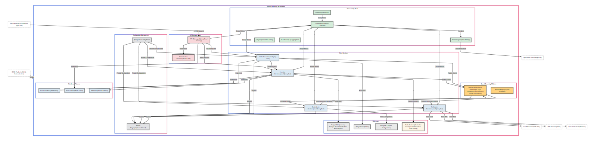

# Detailed Requirements Document Based on the Microservices Architecture Diagram

## 1. Executive Summary

This document outlines the comprehensive requirements for implementing a modern, cloud-native Real-Time Inventory Management & Low-Stock Alerting System based on the provided architecture diagram. The system is designed as a resilient, scalable microservices architecture deployed on Kubernetes, featuring advanced patterns for reliability, observability, and performance.

## 2. System Architecture Overview

The architecture follows a modern microservices approach with clear separation of concerns, distributed data management, event-driven communication, and comprehensive observability. Key architectural components include:


### 2.1 Core Architectural Layers

1. **API Gateway Layer**: Entry point for all client requests with authentication and routing capabilities
2. **Core Services Layer**: Business functionality implemented as independent microservices
3. **Data Layer**: Distributed data storage with specialized databases for different services
4. **Messaging Layer**: Event streaming platform for asynchronous communication
5. **Configuration Management**: Centralized configuration and service discovery
6. **Observability Stack**: Comprehensive monitoring, logging, and tracing
7. **Resilience Patterns**: Implementation of fault tolerance mechanisms

### 2.2 Key Technology Choices

- **Container Orchestration**: Kubernetes for deployment, scaling, and management
- **Service Implementation**: Java/Spring Boot for all microservices
- **API Gateway**: Spring Cloud Gateway for routing and cross-cutting concerns
- **Authentication**: OAuth2/JWT for secure authentication and authorization
- **Databases**: PostgreSQL (with sharding and read replicas) for persistent storage
- **Caching**: Redis Cluster for distributed caching and rate limiting
- **Messaging**: Apache Kafka with Schema Registry for reliable event streaming
- **Service Discovery**: Eureka/Consul for dynamic service registration and discovery
- **Configuration**: Spring Cloud Config Server for externalized configuration
- **Resilience**: Resilience4j for circuit breaking, Redis-based rate limiting, and thread isolation
- **Observability**: Prometheus, Grafana, Alertmanager, Jaeger, and ELK Stack
- **CI/CD**: GitHub Actions/Jenkins for continuous integration and deployment

## 3. Detailed Requirements by Component

### 3.1 API Gateway Layer

#### 3.1.1 API Gateway (Spring Cloud Gateway)
- **Functional Requirements**:
    - Route all incoming client requests to appropriate backend services
    - Implement rate limiting to prevent API abuse
    - Handle request/response transformation when needed
    - Provide a unified entry point for all client applications
    - Support API versioning
    - Implement request logging for audit purposes

- **Non-Functional Requirements**:
    - Handle at least 5,000 concurrent connections
    - Maintain response time overhead under 20ms
    - Achieve 99.95% availability
    - Support horizontal scaling based on traffic patterns

#### 3.1.2 Authentication Service (OAuth2/JWT)
- **Functional Requirements**:
    - Implement OAuth2 authorization flows (Authorization Code, Client Credentials)
    - Issue JWT tokens with appropriate claims and expiration
    - Validate tokens for all protected API requests
    - Support role-based access control (RBAC)
    - Provide token refresh capabilities
    - Implement token revocation

- **Non-Functional Requirements**:
    - Process authentication requests within 200ms
    - Support at least 1,000 authentication requests per second
    - Ensure secure storage of credentials and tokens
    - Implement proper token signing and verification

### 3.2 Core Services

#### 3.2.1 Inventory Service
- **Functional Requirements**:
    - Maintain accurate inventory counts across all locations
    - Process inventory adjustments (increments and decrements)
    - Implement optimistic locking for concurrent updates
    - Provide inventory query capabilities by product and location
    - Publish inventory change events to Kafka
    - Support inventory reservations for order processing
    - Implement inventory reconciliation processes

- **Non-Functional Requirements**:
    - Process inventory updates within 100ms
    - Handle at least 500 inventory transactions per second
    - Maintain data consistency during concurrent operations
    - Implement caching for frequently accessed inventory data
    - Support horizontal scaling for increased load

#### 3.2.2 Order Service
- **Functional Requirements**:
    - Create and manage customer orders
    - Validate inventory availability before order confirmation
    - Update order status throughout the fulfillment process
    - Publish order events to Kafka for downstream processing
    - Support order cancellation and modification
    - Implement order history and tracking

- **Non-Functional Requirements**:
    - Process order creation within 300ms
    - Handle at least 200 orders per second during peak periods
    - Ensure data consistency between orders and inventory
    - Implement circuit breaking for inventory service dependencies
    - Support horizontal scaling based on order volume

#### 3.2.3 Stock Alerter Service
- **Functional Requirements**:
    - Consume inventory change events from Kafka
    - Evaluate stock levels against configured thresholds
    - Generate notification requests for low-stock conditions
    - Support different threshold configurations by product and location
    - Implement alert deduplication logic
    - Provide alert history and status tracking

- **Non-Functional Requirements**:
    - Process inventory events within 200ms
    - Handle at least 1,000 events per second
    - Ensure no duplicate alerts within configurable time windows
    - Support horizontal scaling based on event volume
    - Implement proper error handling and dead-letter queues

#### 3.2.4 Notification Service
- **Functional Requirements**:
    - Consume notification requests from Kafka
    - Support multiple notification channels (email, SMS, push)
    - Implement notification templates with variable substitution
    - Track notification delivery status
    - Support notification prioritization
    - Implement retry logic for failed notifications

- **Non-Functional Requirements**:
    - Process notification requests within 500ms
    - Handle at least 100 notifications per second
    - Ensure reliable delivery of critical notifications
    - Support horizontal scaling based on notification volume
    - Implement rate limiting for external notification services

### 3.3 Data Layer

#### 3.3.1 Inventory Database (PostgreSQL)
- **Functional Requirements**:
    - Store inventory items with product, location, and quantity information
    - Support optimistic locking for concurrent updates
    - Maintain inventory history for auditing
    - Implement database sharding for horizontal scalability
    - Provide read replicas for query optimization

- **Non-Functional Requirements**:
    - Support at least 10 million inventory records
    - Handle 1,000+ transactions per second
    - Maintain data integrity during concurrent operations
    - Achieve sub-50ms query response time for common queries
    - Implement proper backup and recovery procedures

#### 3.3.2 Order Database (PostgreSQL)
- **Functional Requirements**:
    - Store order information including items, quantities, and status
    - Maintain order history and state transitions
    - Support complex queries for order reporting
    - Implement proper indexing for performance optimization

- **Non-Functional Requirements**:
    - Support at least 100 million order records
    - Handle 500+ transactions per second
    - Achieve sub-100ms query response time for common queries
    - Implement proper backup and recovery procedures
    - Support data archiving for older orders

#### 3.3.3 Alert Configuration Database (PostgreSQL)
- **Functional Requirements**:
    - Store alert threshold configurations by product and location
    - Support different threshold types (absolute, percentage)
    - Maintain configuration history for auditing
    - Support bulk configuration updates

- **Non-Functional Requirements**:
    - Support at least 1 million threshold configurations
    - Handle 100+ transactions per second
    - Achieve sub-50ms query response time
    - Implement proper backup and recovery procedures

#### 3.3.4 Redis Cluster (Distributed Cache)
- **Functional Requirements**:
    - Cache frequently accessed inventory data
    - Support distributed rate limiting
    - Implement cache invalidation on data changes
    - Provide configurable TTL for cached items

- **Non-Functional Requirements**:
    - Support at least 10,000 operations per second
    - Maintain sub-5ms response time for cache operations
    - Achieve 99.9% availability through cluster configuration
    - Support horizontal scaling for increased load
    - Implement proper data persistence and recovery

### 3.4 Event Streaming Platform

#### 3.4.1 Apache Kafka
- **Functional Requirements**:
    - Support multiple event types (inventory changes, orders, notifications)
    - Implement topic partitioning for parallel processing
    - Provide exactly-once delivery semantics
    - Support event retention for replay capabilities
    - Implement proper consumer group management

- **Non-Functional Requirements**:
    - Handle at least 10,000 messages per second
    - Maintain message latency under 50ms
    - Achieve 99.99% durability for messages
    - Support horizontal scaling for increased throughput
    - Implement proper monitoring and alerting

#### 3.4.2 Schema Registry
- **Functional Requirements**:
    - Store and manage Avro schemas for all event types
    - Enforce schema compatibility during evolution
    - Support schema versioning
    - Provide schema validation for producers and consumers

- **Non-Functional Requirements**:
    - Handle 1,000+ schema requests per second
    - Maintain sub-50ms response time for schema operations
    - Achieve 99.9% availability
    - Implement proper backup and recovery procedures

### 3.5 Configuration Management

#### 3.5.1 Spring Cloud Config Server
- **Functional Requirements**:
    - Provide centralized configuration for all services
    - Support environment-specific configurations
    - Implement configuration versioning and history
    - Support runtime configuration updates
    - Secure sensitive configuration properties

- **Non-Functional Requirements**:
    - Handle 1,000+ configuration requests per second
    - Maintain sub-50ms response time for configuration retrieval
    - Achieve 99.9% availability
    - Implement proper backup and recovery procedures

#### 3.5.2 Service Registry (Eureka/Consul)
- **Functional Requirements**:
    - Register and discover service instances dynamically
    - Provide health checking for registered services
    - Support service metadata for routing decisions
    - Implement service deregistration on shutdown

- **Non-Functional Requirements**:
    - Handle 1,000+ registry operations per second
    - Maintain sub-50ms response time for service discovery
    - Achieve 99.9% availability
    - Support horizontal scaling for increased load

### 3.6 Observability Stack

#### 3.6.1 Prometheus
- **Functional Requirements**:
    - Collect metrics from all services and infrastructure
    - Implement alerting rules for system health
    - Support service-level objectives (SLOs) monitoring
    - Provide long-term metric storage

- **Non-Functional Requirements**:
    - Handle 100,000+ metrics per second
    - Maintain sub-second query response time
    - Achieve 99.9% availability
    - Support horizontal scaling for increased metric volume

#### 3.6.2 Grafana
- **Functional Requirements**:
    - Provide customizable dashboards for system monitoring
    - Support multiple data sources (Prometheus, logs)
    - Implement alerting based on dashboard metrics
    - Support dashboard sharing and export

- **Non-Functional Requirements**:
    - Handle 100+ concurrent dashboard users
    - Maintain sub-second dashboard loading time
    - Achieve 99.9% availability
    - Support horizontal scaling for increased user load

#### 3.6.3 Alertmanager
- **Functional Requirements**:
    - Route alerts to appropriate notification channels
    - Implement alert grouping and deduplication
    - Support alert silencing and inhibition
    - Provide alert history and status tracking

- **Non-Functional Requirements**:
    - Handle 1,000+ alerts per second
    - Process alerts within 1 second
    - Achieve 99.9% availability
    - Implement proper backup and recovery procedures

#### 3.6.4 Jaeger (Distributed Tracing)
- **Functional Requirements**:
    - Collect and store distributed traces across services
    - Support trace sampling for high-volume systems
    - Provide trace visualization and analysis
    - Implement trace filtering and search

- **Non-Functional Requirements**:
    - Handle 10,000+ spans per second
    - Maintain sub-second trace query response time
    - Achieve 99.9% availability
    - Support horizontal scaling for increased trace volume

#### 3.6.5 ELK Stack (Log Aggregation)
- **Functional Requirements**:
    - Collect logs from all services and infrastructure
    - Implement log parsing and indexing
    - Support log search and analysis
    - Provide log visualization and dashboards

- **Non-Functional Requirements**:
    - Handle 10,000+ log events per second
    - Maintain sub-second log query response time
    - Achieve 99.9% availability
    - Support horizontal scaling for increased log volume

### 3.7 Resilience Patterns

#### 3.7.1 Circuit Breaker (Resilience4j)
- **Functional Requirements**:
    - Implement circuit breaking for service dependencies
    - Support configurable thresholds for circuit opening
    - Provide fallback mechanisms for failed calls
    - Implement circuit half-open state for recovery testing

- **Non-Functional Requirements**:
    - Add less than 5ms overhead to service calls
    - Support at least 1,000 protected calls per second
    - Implement proper monitoring and alerting for circuit state

#### 3.7.2 Rate Limiter (Redis-based)
- **Functional Requirements**:
    - Implement rate limiting for API endpoints
    - Support different rate limit policies (fixed window, sliding window)
    - Provide configurable rate limits by client or endpoint
    - Implement proper rate limit headers in responses

- **Non-Functional Requirements**:
    - Add less than 5ms overhead to API calls
    - Support at least 10,000 rate limit checks per second
    - Implement proper monitoring and alerting for rate limit breaches

#### 3.7.3 Bulkhead (Thread Isolation)
- **Functional Requirements**:
    - Implement thread isolation for critical operations
    - Support configurable thread pools by operation type
    - Provide rejection policies for pool exhaustion
    - Implement proper thread pool monitoring

- **Non-Functional Requirements**:
    - Add less than 1ms overhead to operations
    - Support proper sizing of thread pools based on workload
    - Implement proper monitoring and alerting for pool utilization

## 4. Integration Requirements

### 4.1 External Systems Integration

#### 4.1.1 Email Service (AWS SES)
- **Functional Requirements**:
    - Send transactional emails for notifications
    - Support email templates with variable substitution
    - Track email delivery status
    - Implement retry logic for failed deliveries

- **Non-Functional Requirements**:
    - Send emails within 5 seconds of request
    - Support at least 50 emails per second
    - Achieve 99% delivery rate

#### 4.1.2 SMS Service (Twilio)
- **Functional Requirements**:
    - Send SMS notifications for critical alerts
    - Support message templates with variable substitution
    - Track message delivery status
    - Implement retry logic for failed deliveries

- **Non-Functional Requirements**:
    - Send SMS within 5 seconds of request
    - Support at least 20 SMS per second
    - Achieve 95% delivery rate

#### 4.1.3 Push Notification Service (Firebase)
- **Functional Requirements**:
    - Send push notifications to mobile devices
    - Support notification templates with variable substitution
    - Track notification delivery status
    - Implement proper device token management

- **Non-Functional Requirements**:
    - Send push notifications within 5 seconds of request
    - Support at least 100 push notifications per second
    - Achieve 90% delivery rate

#### 4.1.4 Operations Team Integration (PagerDuty)
- **Functional Requirements**:
    - Send operational alerts for system issues
    - Support alert prioritization and routing
    - Track alert acknowledgment and resolution
    - Implement escalation policies for unacknowledged alerts

- **Non-Functional Requirements**:
    - Send alerts within 1 second of detection
    - Support at least 10 alerts per second
    - Achieve 99.9% delivery rate

### 4.2 Client Integration

#### 4.2.1 Web/Mobile Apps
- **Functional Requirements**:
    - Provide RESTful APIs for all client operations
    - Support authentication and authorization
    - Implement proper error handling and status codes
    - Provide API documentation and client SDKs

- **Non-Functional Requirements**:
    - Maintain API response time under 300ms (95th percentile)
    - Support at least 1,000 API requests per second
    - Achieve 99.9% API availability

#### 4.2.2 B2B Integration
- **Functional Requirements**:
    - Provide secure APIs for business partners
    - Support bulk operations for efficiency
    - Implement proper rate limiting and quotas
    - Provide comprehensive API documentation

- **Non-Functional Requirements**:
    - Maintain API response time under 500ms (95th percentile)
    - Support at least 100 API requests per second per partner
    - Achieve 99.9% API availability

## 5. Deployment and DevOps Requirements

### 5.1 CI/CD Pipeline
- **Functional Requirements**:
    - Implement automated build and test processes
    - Support continuous integration for all code changes
    - Implement continuous delivery to development and staging environments
    - Support continuous deployment to production with approval gates
    - Implement proper artifact versioning and management

- **Non-Functional Requirements**:
    - Complete CI pipeline within 15 minutes
    - Support at least 50 builds per day
    - Achieve 99% build success rate
    - Implement proper security scanning and quality gates

### 5.2 Kubernetes Deployment
- **Functional Requirements**:
    - Deploy all services as containerized applications
    - Implement proper resource requests and limits
    - Support horizontal pod autoscaling based on metrics
    - Implement proper health checks and readiness probes
    - Support zero-downtime deployments

- **Non-Functional Requirements**:
    - Complete service deployment within 5 minutes
    - Support at least 10 deployments per day
    - Achieve 99.9% deployment success rate
    - Implement proper monitoring and alerting for deployment status

## 6. Security Requirements

### 6.1 Authentication and Authorization
- **Functional Requirements**:
    - Implement OAuth2/JWT for authentication
    - Support role-based access control for all services
    - Implement proper token validation and expiration
    - Support secure credential storage and management

- **Non-Functional Requirements**:
    - Complete authentication within 200ms
    - Support at least 1,000 authentication requests per second
    - Implement proper security monitoring and alerting

### 6.2 Data Protection
- **Functional Requirements**:
    - Encrypt sensitive data at rest and in transit
    - Implement proper data masking for PII
    - Support secure key management
    - Implement proper data access controls

- **Non-Functional Requirements**:
    - Add less than 10ms overhead for encryption/decryption
    - Implement proper key rotation procedures
    - Support compliance with relevant regulations (GDPR, etc.)

### 6.3 API Security
- **Functional Requirements**:
    - Implement proper input validation for all APIs
    - Support rate limiting to prevent abuse
    - Implement proper CORS policies
    - Support API key management for B2B partners

- **Non-Functional Requirements**:
    - Add less than 5ms overhead for security checks
    - Implement proper security monitoring and alerting
    - Support regular security audits and penetration testing

## 7. Performance Requirements

### 7.1 Throughput
- The system must handle at least 1,000 inventory transactions per second during peak periods
- The system must support at least 500 orders per second during peak periods
- The API Gateway must handle at least 5,000 requests per second

### 7.2 Latency
- API response time must be under 300ms for 95% of requests
- Inventory updates must be processed within 100ms
- Order creation must be completed within 300ms
- Alerts must be generated within 1 second of threshold breach

### 7.3 Scalability
- All services must support horizontal scaling to handle increased load
- The system must support at least 1 million concurrent users
- The database must support at least 10 million inventory items
- The system must support at least 100 million orders

## 8. Reliability Requirements

### 8.1 Availability
- The system must maintain 99.9% uptime (less than 8.8 hours of downtime per year)
- Critical services (Inventory, Order) must maintain 99.95% uptime
- Planned maintenance must not impact system availability

### 8.2 Fault Tolerance
- The system must continue to function with degraded performance during partial failures
- Circuit breakers must prevent cascading failures
- The system must implement proper retry mechanisms for transient failures
- Data must be replicated across multiple nodes for redundancy

### 8.3 Disaster Recovery
- The system must implement proper backup and recovery procedures
- Recovery Point Objective (RPO): No more than 5 minutes of data loss
- Recovery Time Objective (RTO): System must be restored within 30 minutes

## 9. Implementation Phases

### 9.1 Phase 1: Core Infrastructure and Services
- Implement Kubernetes cluster and basic infrastructure
- Deploy API Gateway and Authentication Service
- Implement Inventory Service with basic functionality
- Deploy PostgreSQL and Redis for data storage
- Implement basic monitoring with Prometheus and Grafana

### 9.2 Phase 2: Order Processing and Event Streaming
- Implement Order Service with basic functionality
- Deploy Kafka and Schema Registry
- Implement event-based communication between services
- Enhance Inventory Service with event publishing
- Implement basic resilience patterns (Circuit Breaker)

### 9.3 Phase 3: Alerting and Notification
- Implement Stock Alerter Service
- Implement Notification Service
- Integrate with external notification services (Email, SMS, Push)
- Enhance monitoring and alerting capabilities
- Implement advanced resilience patterns (Rate Limiter, Bulkhead)

### 9.4 Phase 4: Advanced Features and Optimization
- Implement database sharding and read replicas
- Enhance caching strategies for performance optimization
- Implement advanced observability with Jaeger and ELK Stack
- Optimize service performance and resource utilization
- Implement comprehensive security measures

## 10. Acceptance Criteria

### 10.1 Functional Acceptance Criteria
- All services must implement their specified functionality
- The system must correctly process inventory transactions
- The system must generate appropriate alerts for low-stock conditions
- The system must deliver notifications through specified channels
- All APIs must function according to their specifications

### 10.2 Non-Functional Acceptance Criteria
- The system must meet all specified performance requirements
- The system must achieve the specified availability targets
- The system must implement all specified security measures
- The system must pass all specified load and stress tests
- The system must implement all specified observability features

## 11. Glossary

| Term | Definition |
|------|------------|
| **API Gateway** | A server that acts as an API front-end, receiving API requests, enforcing throttling and security policies, passing requests to the back-end service, and then passing the response back to the requester. |
| **Circuit Breaker** | A design pattern used to detect failures and encapsulates the logic of preventing a failure from constantly recurring. |
| **Kubernetes** | An open-source container orchestration system for automating application deployment, scaling, and management. |
| **Microservice** | A software development technique where an application is structured as a collection of loosely coupled services. |
| **Rate Limiter** | A technique used to control the rate of traffic sent or received by a network interface controller. |
| **Schema Registry** | A system that stores and manages schemas for event data, ensuring compatibility between producers and consumers. |
| **Service Discovery** | The automatic detection of devices and services offered by these devices on a computer network. |
| **Sharding** | A type of database partitioning that separates large databases into smaller, faster, more easily managed parts called data shards. |


# Cloud-native Real-Time Inventory Management & Low-Stock Alerting System

This project is a cloud-native real-time inventory management system with low-stock alerting capabilities. It leverages modern technologies such as Spring Boot, Kafka, Redis, and Kubernetes to provide a scalable and resilient architecture.

## System Design

The following diagram showcases the system design:

```mermaid
graph TD
classDef service fill:#dbe9f4,stroke:#333,stroke-width:2px;
classDef database fill:#e9e9e9,stroke:#333,stroke-width:2px;
classDef cache fill:#fdf5e6,stroke:#333,stroke-width:2px;
classDef broker fill:#ffd27f,stroke:#333,stroke-width:2px;
classDef monitoring fill:#d4edda,stroke:#333,stroke-width:2px;
classDef external fill:#ffffff,stroke:#666,stroke-width:1px,stroke-dasharray: 5 5;
classDef gateway fill:#f8d7da,stroke:#333,stroke-width:2px;
classDef config fill:#e2e3e5,stroke:#333,stroke-width:2px;

subgraph SystemBoundary["System Boundary (Kubernetes Cluster)"]
direction TB

subgraph APILayer["API Gateway Layer"]
apiGateway["API Gateway\n(Spring Cloud Gateway)"]:::gateway
authService["Authentication Service\n(OAuth2/JWT)"]:::service
end

subgraph CoreServices["Core Services"]
inventorySvc["Inventory Service\n(Java/Spring Boot)"]:::service
orderSvc["Order Service\n(Java/Spring Boot)"]:::service
alerterSvc["Stock Alerter Service\n(Java/Spring Boot)"]:::service
notificationSvc["Notification Service\n(Java/Spring Boot)"]:::service
end

subgraph DataLayer["Data Layer"]
inventoryDb["PostgreSQL\n(Inventory Items)\n- Sharded for Scale\n- Read Replicas"]:::database
orderDb["PostgreSQL\n(Orders)"]:::database
alertConfigDb["PostgreSQL\n(Alert Configurations)"]:::database
redisCache["Redis Cluster\n(Distributed Cache)\n- Stock Counts\n- Rate Limiting"]:::cache
end

subgraph Messaging["Event Streaming Platform"]
kafkaBroker["Apache Kafka\n(Event Streaming)\n- High Throughput\n- Persistence\n- Exactly-once delivery"]:::broker
schemaRegistry["Schema Registry\n(Avro Schemas)"]:::service
end

subgraph ConfigManagement["Configuration Management"]
configServer["Spring Cloud Config Server"]:::config
serviceRegistry["Service Registry\n(Eureka/Consul)"]:::config
end

subgraph Monitoring["Observability Stack"]
prometheus["Prometheus\n(Metrics Collection)"]:::monitoring
grafana["Grafana\n(Dashboards)"]:::monitoring
alertmanager["Alertmanager\n(Alert Routing)"]:::monitoring
jaeger["Jaeger\n(Distributed Tracing)"]:::monitoring
elk["ELK Stack\n(Log Aggregation)"]:::monitoring
end

subgraph Resilience["Resilience Patterns"]
circuitBreaker["Circuit Breaker\n(Resilience4j)"]:::service
rateLimiter["Rate Limiter\n(Redis-based)"]:::service
bulkhead["Bulkhead\n(Thread Isolation)"]:::service
end

end

extClient["External Clients\n(Web/Mobile Apps, B2B)"]:::external
emailSvc["Email Service\n(AWS SES)"]:::external
smsSvc["SMS Service\n(Twilio)"]:::external
pushSvc["Push Notification\n(Firebase)"]:::external
opsTeam["Operations Team\n(PagerDuty)"]:::external
cicd["CI/CD Pipeline\n(GitHub Actions/Jenkins)"]:::external

extClient -- "HTTPS Requests" --> apiGateway
apiGateway -- "Authenticate" --> authService
apiGateway -- "Route Requests" --> inventorySvc
apiGateway -- "Route Requests" --> orderSvc
inventorySvc -- "Read/Write" --> inventoryDb
inventorySvc -- "Cache Operations" --> redisCache
inventorySvc -- "Publish Events" --> kafkaBroker
orderSvc -- "Read/Write" --> orderDb
orderSvc -- "Publish Events" --> kafkaBroker
orderSvc -- "Check Inventory" --> inventorySvc
kafkaBroker -- "Consume Events" --> alerterSvc
alerterSvc -- "Read Configurations" --> alertConfigDb
alerterSvc -- "Send Notification Requests" --> kafkaBroker
kafkaBroker -- "Consume Notification Events" --> notificationSvc
notificationSvc -- "Send Email" --> emailSvc
notificationSvc -- "Send SMS" --> smsSvc
notificationSvc -- "Send Push" --> pushSvc
configServer -- "Provide Configurations" --> inventorySvc
configServer -- "Provide Configurations" --> orderSvc
configServer -- "Provide Configurations" --> alerterSvc
configServer -- "Provide Configurations" --> notificationSvc
inventorySvc -- "Register" --> serviceRegistry
orderSvc -- "Register" --> serviceRegistry
alerterSvc -- "Register" --> serviceRegistry
notificationSvc -- "Register" --> serviceRegistry
prometheus -- "Scrape Metrics" --> inventorySvc
prometheus -- "Scrape Metrics" --> orderSvc
prometheus -- "Scrape Metrics" --> alerterSvc
prometheus -- "Scrape Metrics" --> notificationSvc
prometheus -- "Scrape Metrics" --> apiGateway
grafana -- "Query Metrics" --> prometheus
prometheus -- "Fire Alerts" --> alertmanager
alertmanager -- "Send Notifications" --> opsTeam
inventorySvc -- "Implements" --> circuitBreaker
orderSvc -- "Implements" --> circuitBreaker
apiGateway -- "Implements" --> rateLimiter
inventorySvc -- "Implements" --> bulkhead
cicd -- "Deploy" --> SystemBoundary

class apiGateway,authService gateway;
class inventorySvc,orderSvc,alerterSvc,notificationSvc service;
class inventoryDb,orderDb,alertConfigDb database;
class redisCache cache;
class kafkaBroker,schemaRegistry broker;
class configServer,serviceRegistry config;
class prometheus,grafana,alertmanager,jaeger,elk monitoring;
class circuitBreaker,rateLimiter,bulkhead service;
class extClient,emailSvc,smsSvc,pushSvc,opsTeam,cicd external;

